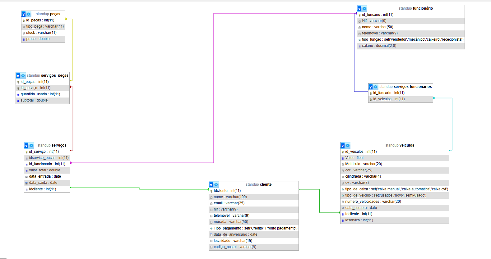

# Standcar-Stand de automoveis

 Elementos do grupo

|Número|Nome            |
|:-----|:---------------|
|a22201793 |André Matos |
|a22211659 |Pedro Cruz  |

# Tema do trabalho

O nosso projeto consiste na criação de uma base de dados de um stand de automoveis que vai vender veiculos novos,usados,semi-novos com serviço de oficina para esses veiculos.
Vai ser possivel saber o nome dos funcionarios e a sua função prestada no stand ou na oficina  
Onde vai ser possivel saber quantas peças sao gastas atraves da reparação

Os nossos  serviços  comercializados serão:

Automoveis novos

Automoveis velhos

Serviço de oficina
 
Gestao de peças 

# Entidades identificadas

Vamos identificar todas as entidades relevantes no contexto do problema, através da análise dos substantivos. 
As entidades identificadas na descrição do problema são:

Clientes

Veiculos
 
Serviços

Funcionarios

Serviço_peças

Peças

Serviço_funcionarios

# Modelo da base de dados

# Tabelas e as relações da base de dados

Tabela: Funcionarios

|Campo|Chave|Tipo de dados|
|:---|:---|:---|
|idfuncionario|Chave Primária|Numérico|
|Nif|N/A|varchar(9)|
|nome|N/A|varchar(50)|
|telemovel|N/A|varchar(9)|
|tipo_funçao|N/A|set('vendedor', 'mecanico','caixeiro','rececionista')|
|salario|N/A|decimal(2,0)|

Tabela: Clientes

|Campo|Chave|Tipo de dados|
|:---|:---|:---|
|ClienteID|Chave Primária|Numérico|
|Nome|N/A|Texto|
|Email|N/A|Texto|
|Contribuinte|N/A|Numérico|
|Morada|N/A|Texto|
|Telemóvel/Telefone|N/A|Numérico|
|tipo_pagamento|N/A|set('Credito','Pronto pagamento')|
|data_de_aniversario|N/A|date|
|localidade|N/A|Numérico|
|Codigo Postal|N/A|Numérico|

Tabela: Veiculos

|Campo|Chave|Tipo de dados|
|:---|:---|:---|
|veiculosID|Chave Primária|Numérico|
|Valor|N/A|float|
|Matricula|N/A|varchar(20)|
|Cor|N/A|varchar(25)|
|cv|N/A|varchar(3)|
|tipo_de_caixa|N/A|set('caixa manual', 'caixa automatica', 'caixa cvt')
|tipo_de_veiculo|N/A|set('usados', 'novo', 'semi-usado')|
|numero_velocidades	|N/A|varchar(20)|
|id_funcionario|Índice|Numérico|
|data_compra|N/A|date|
|Idcliente|Índice|Numérico|
|idserviço|Índice|Numérico|

Tabela: Serviços
|Campo|Chave|Tipo de dados|
|:---|:---|:---|
|Idserviço|Chave Primária|Numérico|
|Idserviço_peças|N/A|Numérico|
|idfuncionario|N/A|Numérico|
|dvalor_total|N/A|double|
|data_entrada|N/A|date|
|data_saida|N/A|date|
|idcliente|Índice|Numerico|

Tabela: Peças
|Campo|Chave|Tipo de dados|
|:---|:---|:---|
|Id_peça|Chave Primária|Numérico|
|tipo_peça|N/A|varchar(11)|
|stock|N/A|varchar(11)|
|preco|N/A|double|

Tabela: Serviços_peças
|Campo|Chave|Tipo de dados|
|:---|:---|:---|
|Idservico_peca|Chave Primária|Numérico|
|id_peças|N/A|varchar(11)|
|id_serviço|N/A|varchar(11)|
|quantidade_usada|N/A|double|
|subtotal|N/A|double|

Tabela: Serviços_funcionarios
|Campo|Chave|Tipo de dados|
|:---|:---|:---|
|Id_funcionario|Chave Primária|Numérico|
|id_veiculos|Chave Primária|Numérico|

